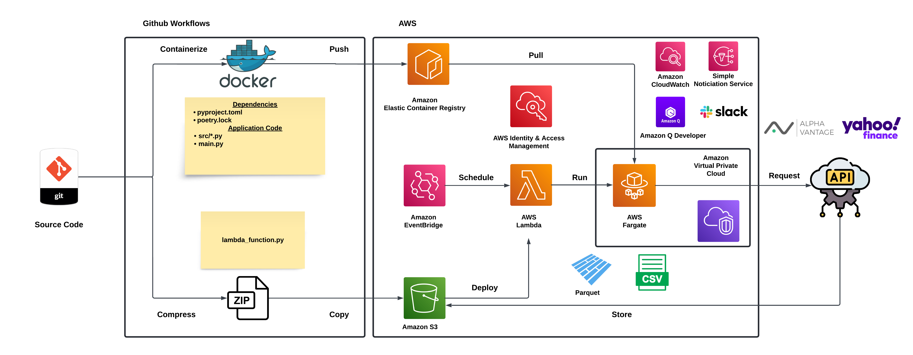

# ETF KPIs Scraper

This is a Python 3 based daily scraper that collects data on actively listed ETFs using the [Alpha Vantage](https://www.alphavantage.co/#page-top) and [Yahoo Finance](https://finance.yahoo.com/) APIs (via the [yfinance](https://pypi.org/project/yfinance/) package).

The main infrastructure of the scraper includes:

* **Amazon EventBridge**: Triggers a Lambda function to run daily at 5:00 PM EST / 4:00 PM CST on weekdays after the market closes.
* **AWS Lambda**: Starts an AWS Fargate task, which runs the containerized application code.
* **AWS Fargate**: Executes the application code to collect and process ETF data, then stores the data in an S3 bucket as either a Parquet file or a CSV file.

<p align="center">
  
</p>

For a detailed walkthrough of the project, check out the following blog post: [Scraping ETF KPIs with AWS Lambda, AWS Fargate, and Alpha Vantage](https://kenwuyang.com/posts/2024_06_22_scraping_etf_kpis_with_aws_lambda_aws_fargate_and_alpha_vantage_yahoo_finance_apis/).

# Project Setup

## Fork and Clone the Repository

Fork the repository and clone the forked repository to local machine:

```bash
# HTTPS
$ git clone https://github.com/YOUR_GITHUB_USERNAME/etf-kpis-scraper.git
# SSH
$ git clone git@github/YOUR_GITHUB_USERNAME/etf-kpis-scraper.git
```

## Set Up with `poetry`

Install `poetry` using the official installer. Detailed instructions can be found in [Poetry's Official Documentation](https://python-poetry.org/docs/#installing-with-the-official-installer). Make sure to add `poetry` to your PATH. Refer to the official documentation linked above for specific steps for different operating systems.

There are three primary methods to set up and use `poetry` for this project:

### Method 1: Python Interpreter tied to a Virtual Environment

Configure `poetry` to create the virtual environment inside the project's root directory (and only do so for the current project[--local](https://python-poetry.org/docs/configuration/#local-configuration) flag):

```bash
$ poetry config virtualenvs.in-project true --local
$ cd path_to_cloned_repository
$ poetry sync --all-groups
```

### Method 2: Python Interpreter Managed by `pyenv`

With [pyenv](https://github.com/pyenv/pyenv), ensure that Python (`3.12` is the default for this project) is installed:

```bash
# List available Python versions 10 through 12
$ pyenv install --list | grep " 3\.\(10\|11\|12\)\."
# As an example, install Python 3.12.8
$ pyenv install 3.12.8
# Activate Python 3.12.8 for the current project
$ pyenv local 3.12.8
$ poetry sync --all-groups
```

### Method 3: Python Interpreter Managed by `conda`

1. Create a new conda environment named `etf_kpis_scraper` with Python `3.12`:

```bash
$ yes | conda create --name etf_kpis_scraper python=3.12
```

2. Install the project dependencies (ensure that the `conda` environment is activated):

```bash
$ cd path_to_cloned_repository
$ conda activate etf_kpis_scraper
$ poetry sync --all-groups
```

## Environment Variables

To test run the code locally, create a `.env` file in the root directory with the following environment variables:

```bash
API_KEY=your_alpha_vantage_api_key
S3_BUCKET=your_s3_bucket_name
IPO_DATE=threshold_for_etf_ipo_date
MAX_ETFS=maximum_number_of_etfs_to_scrape
PARQUET=True
ENV=dev
```

Set `ENV` to `dev` (i.e., the default) to run the scraper in `dev` mode when running the entrypoint `main.py` locally.

Details on these environment variables can be found in the [Modules](https://kenwuyang.com/posts/2024_06_22_scraping_etf_kpis_with_aws_lambda_aws_fargate_and_alpha_vantage_yahoo_finance_apis/#modules) subsection of the blog post.

## Workflow Secrets

The workflows require the following secrets:

* `AWS_GITHUB_ACTIONS_ROLE_ARN`: The ARN of the IAM role that GitHub Actions assumes to deploy to AWS.

* `AWS_REGION`: The AWS region where the resources are deployed.

* `ECR_REPOSITORY`: The name of the ECR repository where the Docker image is stored.

* `S3_BUCKET`: The name of the S3 bucket where the ETF data is stored.

* `LAMBDA_FUNCTION`: The name of the Lambda function that triggers the Fargate task.

## AWS CLI for Programmatic Deployment

To deploy the resources programmatically via Terraform instead of using the AWS console, ensure that the AWS CLI is installed on the machine used for development and that it is configured with the necessary credentials (See the [AWS CLI Documentation](https://docs.aws.amazon.com/cli/latest/userguide/cli-configure-quickstart.html)).

A simple starting point, though it violates the principle of least privilege, is to use the [AdministratorAccess](https://docs.aws.amazon.com/aws-managed-policy/latest/reference/AdministratorAccess.html) policy.
